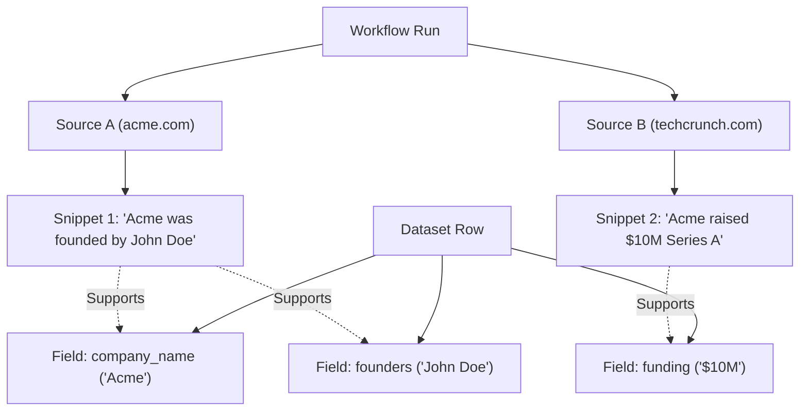

# Frontend Integration Contract — Scoutly Platform

> **Target Version:** 1.0.0  
> **Status:** Verified Backend Contract  
> **Specification Reference:** [OpenAPI 3.1.0 Spec](file:///d:/AI-Powerd%20Data%20Intelligence/backend/docs/openapi.json) / `GET /api/v1/openapi.json`  
> **Note:** This document defines the exact contract provided by the backend for the future Scoutly web interface. No final frontend code is implemented in this phase.

---

## 1. Global Conventions & Architecture

### 1.1 Base URLs & Protocols
- **API Base URL:** `/api/v1` (e.g., `http://localhost:3000/api/v1` in development).
- **Transport:** HTTP/1.1 and HTTP/2 over TLS; Server-Sent Events (`text/event-stream`) for live execution streaming.
- **Content Types:**
  - Standard payloads: `application/json; charset=utf-8`
  - Real-time streams: `text/event-stream`
  - Exports: `text/csv`, `application/json`, `application/vnd.openxmlformats-officedocument.spreadsheetml.sheet`

### 1.2 Authentication & Security Headers
All protected endpoints require an HTTP Bearer JWT token issued via the Auth endpoints.

```http
Authorization: Bearer <accessToken>
X-Workspace-ID: <workspaceUuid>   # Optional if supplied via route/query/body or user default workspace
X-Request-ID: <clientUuid>        # Optional client tracing ID; echoed in response headers
```

#### Security Invariants:
1. **Client Identity Protection:** Authenticated callers cannot spoof identities. Any client-supplied `userId`, `createdById`, or `requestedById` that does not match the token's authenticated subject (`sub`) is rejected with `403 FORBIDDEN_USER_MISMATCH`.
2. **Workspace Isolation:** All workflows, runs, datasets, sources, evidence, and exports are strictly isolated by `workspaceId`. A user who is not an active `WorkspaceMember` with sufficient privileges (`OWNER`, `ADMIN`, or `MEMBER`) receives `403 WORKSPACE_ACCESS_DENIED`.
3. **Password Sanitization:** Password hashes (`passwordHash`) are never returned in any response, log, or user model.

### 1.3 Uniform Error Response Envelope
Every non-2xx response returns a consistent JSON envelope:

```json
{
  "error": {
    "message": "User does not have active access to this workspace",
    "code": "WORKSPACE_ACCESS_DENIED",
    "details": {
      "workspaceId": "c2a9a7df-13c5-430c-a991-31cb84394982"
    }
  }
}
```

#### Common Error Codes:
| HTTP Status | Code | Meaning |
|---|---|---|
| `400` | `INVALID_INPUT` / `VALIDATION_FAILED` | Request schema violation or malformed body |
| `401` | `UNAUTHENTICATED` | Missing, malformed, or expired Bearer token |
| `401` | `TOKEN_EXPIRED` | Access or refresh token has expired |
| `401` | `TOKEN_REVOKED` | Refresh token was revoked via logout |
| `401` | `INVALID_CREDENTIALS` | Incorrect email or password during login |
| `403` | `FORBIDDEN_USER_MISMATCH` | Client tried to pass a foreign `userId` / `createdById` |
| `403` | `WORKSPACE_ACCESS_DENIED` | User is not a member of target workspace |
| `403` | `INSUFFICIENT_PERMISSIONS` | Role does not meet required minimum privilege |
| `404` | `NOT_FOUND` / `<ENTITY>_NOT_FOUND` | Specified resource does not exist in workspace |
| `409` | `EMAIL_ALREADY_EXISTS` | Registration email conflict |
| `422` | `UNPROCESSABLE_PROMPT` / `PLANNING_FAILED` | LLM planning or prompt parse failure |
| `500` | `INTERNAL_SERVER_ERROR` | Unhandled server error |

---

## 2. Core Architectural Patterns

### 2.1 Server-Sent Events (SSE) Protocol (`GET /api/v1/runs/:id/events`)
The frontend connects using the standard browser `EventSource` interface to monitor live workflow progress.

```typescript
const eventSource = new EventSource(`/api/v1/runs/${runId}/events?token=${accessToken}`);

eventSource.onmessage = (event) => {
  const payload = JSON.parse(event.data);
  console.log("Activity Action:", payload.action);
};
```

#### Wire Protocol Format:
```http
: keepalive

id: 71cb294a-9b1d-4054-9549-33d7b889d1b5
event: message
data: {"id":"71cb294a-9b1d-4054-9549-33d7b889d1b5","runId":"8e73428d...","workflowId":"4a7199c0...","workspaceId":"c2a9a7df...","action":"SCRAPE_STARTED","entityType":"SOURCE","entityId":"source-123","description":"Scraping source https://example.com/ai","metadata":{"domain":"example.com"},"createdAt":"2026-09-28T10:02:15.000Z"}

```

#### SSE Guarantees & Features:
- **Historical Replay:** Upon connection, all historical `ActivityEvent` records stored in MySQL for the run are replayed in chronological order before live events begin.
- **Cross-Process Pub/Sub:** Live events are distributed across multi-node workers via Redis channel `aidp:run:${runId}:events`.
- **Deduplication:** Events already streamed or replayed are deduplicated by `id`.
- **Keepalive Pings:** Comment lines (`: keepalive\n\n`) are dispatched every 15 seconds to prevent proxy / NAT timeouts.
- **Reconnection with `Last-Event-ID`:** Clients pass the standard `Last-Event-ID` header on reconnect; events after that ID are automatically caught up.
- **Canonical Action Types:**
  - `PLANNING_STARTED`, `PLAN_CREATED`
  - `SOURCE_DISCOVERY_STARTED`, `SOURCE_DISCOVERED`
  - `SCRAPE_STARTED`, `SCRAPE_COMPLETED`
  - `EXTRACTION_STARTED`, `RECORDS_EXTRACTED`
  - `VALIDATION_COMPLETED`, `DEDUPLICATION_COMPLETED`
  - `DATASET_CREATED`, `RUN_COMPLETED`, `RUN_FAILED`, `RUN_CANCELLED`

---

### 2.2 Uniform Pagination Envelope
All paginated collection endpoints (`/datasets`, `/datasets/:id/rows`, `/datasets/:id/sources`, `/workflows`, `/workflows/:id/runs`) adhere to this standard response structure:

```json
{
  "items": [ /* records */ ],
  "pagination": {
    "page": 1,
    "limit": 20,
    "total": 52,
    "totalPages": 3,
    "hasMore": true
  }
}
```

#### Query Parameters:
- `page`: 1-based page index (integer, default `1`).
- `limit`: Items per page (integer, default `20`, maximum `100`).

---

### 2.3 Filter & Search Syntax
Dataset rows (`GET /api/v1/datasets/:id/rows`) and exports (`POST /api/v1/datasets/:id/exports`) share identical filter parameters:

| Parameter | Type | Description | Example |
|---|---|---|---|
| `search` | `string` | Case-insensitive substring search across all row values and raw values | `?search=biotech` |
| `validOnly` | `boolean` | If `true`, returns only rows where `isValid = true` | `?validOnly=true` |
| `duplicatesOnly` | `boolean` | If `true`, returns only rows flagged as duplicates (`isDuplicate = true`) | `?duplicatesOnly=true` |
| `verificationStatus` | `string` | Filter by `VERIFIED`, `SOURCE_CITED_UNVERIFIED`, `UNSUPPORTED`, `CONFLICTED` | `?verificationStatus=VERIFIED` |
| `minConfidence` | `number` | Float threshold between `0.0` and `1.0` | `?minConfidence=0.90` |
| `sourceId` | `UUID` | Only returns rows derived from or supported by the specified source | `?sourceId=71cb294a...` |
| `fieldFilters` | `string` (JSON) | Substring match on dynamic fields | `?fieldFilters={"company_name":"Alpha"}` |
| `sortBy` | `string` | Schema column key or meta field (`rowNumber`, `confidenceScore`, `createdAt`) | `?sortBy=company_name` |
| `sortOrder` | `string` | Sort direction: `asc` or `desc` (default `asc`) | `?sortOrder=desc` |

---

### 2.4 Dynamic Dataset Columns Architecture
Different workflows produce different schemas (e.g., AI startups vs. clinical trials vs. real estate listings). Scoutly does **not** store everything as an unsearchable single JSON blob.

1. **Schema Definition (`GET /api/v1/datasets/:id/schema`):** Returns typed columns with order:
   ```json
   {
     "datasetId": "e9f0a1b2-c3d4-4e5f-6a7b-8c9d0e1f2a3b",
     "columns": [
       { "id": "uuid-1", "name": "Company Name", "key": "company_name", "type": "string", "required": true, "orderIndex": 0 },
       { "id": "uuid-2", "name": "Funding (€)", "key": "funding_amount", "type": "currency", "required": false, "orderIndex": 1 }
     ]
   }
   ```
2. **Row Storage (`values` object):** Rows contain a strongly-typed dynamic key-value map keyed by column `key`:
   ```json
   {
     "values": {
       "company_name": "Alpha AI",
       "funding_amount": "€12,000,000"
     }
   }
   ```
3. **Safety & Injection Defense:** Column keys are validated against the dataset's registered columns before being parameterized in safe MySQL JSON extraction queries.

---

### 2.5 Row, Source, and Evidence Provenance Hierarchy
The platform guarantees verifiable explainability ("Where did this data come from?").



- A dataset row can originate from **multiple sources**.
- A specific field (e.g. `founders`) points to one or more supporting source snippets with an explicit verification check (`isVerified: true/false`).
- Conflicting values between different sources are preserved in `conflictingSources`.

---

## 3. Complete Endpoint Reference by Core Area

### Core Area 1: Auth
Base path: `/api/v1/auth`

#### `POST /api/v1/auth/register`
- **Auth:** None (Public)
- **Request Body:**
  ```json
  {
    "email": "analyst@acme.ai",
    "password": "StrongPassword123!",
    "name": "Jane Doe",
    "workspaceName": "Acme Market Intelligence"
  }
  ```
- **Response (201 Created):**
  ```json
  {
    "user": {
      "id": "9b1deb4d-3b7d-4bad-9bdd-2b0d7b3dcb6d",
      "email": "analyst@acme.ai",
      "name": "Jane Doe",
      "status": "ACTIVE",
      "createdAt": "2026-09-28T10:00:00.000Z",
      "updatedAt": "2026-09-28T10:00:00.000Z"
    },
    "workspaces": [
      {
        "id": "c2a9a7df-13c5-430c-a991-31cb84394982",
        "name": "Acme Market Intelligence",
        "slug": "acme-market-intelligence",
        "role": "OWNER",
        "status": "ACTIVE",
        "createdAt": "2026-09-28T10:00:00.000Z"
      }
    ],
    "tokens": {
      "accessToken": "eyJhbGciOi...",
      "refreshToken": "eyJhbGciOi...",
      "tokenType": "Bearer",
      "expiresIn": 900
    }
  }
  ```
- **Errors:** `400 INVALID_INPUT`, `409 EMAIL_ALREADY_EXISTS`.

#### `POST /api/v1/auth/login`
- **Auth:** None (Public)
- **Request Body:** `{ "email": "analyst@acme.ai", "password": "StrongPassword123!" }`
- **Response (200 OK):** Identical structure to register response (`user`, `workspaces`, `tokens`).
- **Errors:** `400 INVALID_INPUT`, `401 INVALID_CREDENTIALS`, `403 ACCOUNT_INACTIVE`.

#### `POST /api/v1/auth/refresh`
- **Auth:** None (passes refreshToken)
- **Request Body:** `{ "refreshToken": "eyJhbGciOi..." }`
- **Response (200 OK):** `{ "accessToken": "...", "refreshToken": "...", "tokenType": "Bearer", "expiresIn": 900 }`
- **Errors:** `400 INVALID_INPUT`, `401 TOKEN_EXPIRED` / `INVALID_TOKEN` / `TOKEN_REVOKED`.

#### `POST /api/v1/auth/logout`
- **Auth:** Optional Bearer token or body `refreshToken`
- **Request Body:** `{ "refreshToken": "eyJhbGciOi..." }`
- **Response (200 OK):** `{ "success": true, "message": "Successfully logged out" }`

#### `GET /api/v1/auth/me`
- **Auth:** `Bearer <accessToken>`
- **Response (200 OK):** `{ "user": { ... }, "workspaces": [ ... ] }`
- **Errors:** `401 UNAUTHENTICATED`, `404 USER_NOT_FOUND`.

---

### Core Area 2: Requirements
Base path: `/api/v1/requirements`

#### `POST /api/v1/requirements/parse`
- **Screen:** Screen 1 (New Research Task)
- **Auth:** `Bearer <accessToken>`
- **Request Body:**
  ```json
  {
    "prompt": "Find top 50 AI companies in Berlin with founders, funding amount, and website",
    "workspaceId": "c2a9a7df-13c5-430c-a991-31cb84394982"
  }
  ```
- **Response (200 OK) — Ready:**
  ```json
  {
    "status": "ready",
    "requirement": {
      "entity": "AI Startup",
      "objective": "Collect AI companies in Berlin with founders, funding amount, and website",
      "fields": [
        { "name": "company_name", "type": "string", "required": true, "description": "Official company name" },
        { "name": "founders", "type": "string", "required": false, "description": "Names of founders" },
        { "name": "funding_amount", "type": "currency", "required": false, "description": "Total funding" },
        { "name": "website", "type": "url", "required": true, "description": "Official homepage" }
      ],
      "constraints": {
        "geographic": ["Berlin", "Germany"],
        "sampleLimit": 50
      }
    },
    "clarificationQuestions": []
  }
  ```
- **Response (200 OK) — Needs Clarification:**
  ```json
  {
    "status": "needs_clarification",
    "requirement": null,
    "clarificationQuestions": [
      "Which specific European countries should be included?",
      "Should we filter for B2B or B2C startups?"
    ]
  }
  ```
- **Errors:** `400 INVALID_REQUEST_BODY`, `422 UNPROCESSABLE_PROMPT`.

---

### Core Area 3: Workflows
Base path: `/api/v1/workflows`

#### `POST /api/v1/workflows/plan`
- **Screen:** Screen 2 (Workflow Preview)
- **Auth:** `Bearer <accessToken>`
- **Request Body:**
  ```json
  {
    "prompt": "Find top 50 AI companies in Berlin",
    "workspaceId": "c2a9a7df-13c5-430c-a991-31cb84394982"
  }
  ```
- **Response (200 OK):**
  ```json
  {
    "workflowId": "4a7199c0-fd0e-4a6c-9494-11883be71261",
    "planVersion": 1,
    "requirement": { /* parsed requirement */ },
    "plan": {
      "version": 1,
      "steps": [
        { "id": "step-1", "name": "Search sources", "type": "SEARCH", "tool": "search", "params": { "query": "AI companies Berlin" } },
        { "id": "step-2", "name": "Scrape company sites", "type": "SCRAPE", "tool": "scrape", "dependsOn": ["step-1"], "params": {} },
        { "id": "step-3", "name": "Extract company entities", "type": "EXTRACT", "tool": "extract", "dependsOn": ["step-2"], "params": {} },
        { "id": "step-4", "name": "Validate & deduplicate", "type": "VALIDATE", "tool": "validate", "dependsOn": ["step-3"], "params": {} },
        { "id": "step-5", "name": "Save dataset", "type": "SAVE", "tool": "save", "dependsOn": ["step-4"], "params": {} }
      ],
      "sourcePolicy": {
        "allowedDomains": [],
        "blockedDomains": ["spam.com"],
        "maxSources": 25
      },
      "completionCriteria": { "minRecords": 10 }
    }
  }
  ```

#### `POST /api/v1/workflows/execute`
- **Screen:** Screen 2 -> Screen 3 Transition
- **Auth:** `Bearer <accessToken>`
- **Request Body:** `{ "prompt": "Find top 50 AI companies in Berlin", "workspaceId": "..." }`
- **Response (202 Accepted):**
  ```json
  {
    "workflowId": "4a7199c0-fd0e-4a6c-9494-11883be71261",
    "runId": "8e73428d-29c8-472b-8762-5b9487c6f059",
    "status": "QUEUED",
    "message": "Workflow created, planned, and queued for execution"
  }
  ```

#### `POST /api/v1/workflows/:id/run`
- **Screen:** Screen 4 (Re-run Workflow)
- **Auth:** `Bearer <accessToken>`
- **Request Body:** `{ "workspaceId": "..." }`
- **Response (202 Accepted):** `{ "runId": "8e73428d...", "workflowId": "4a7199c0...", "status": "QUEUED" }`

#### `GET /api/v1/workflows`
- **Screen:** Screen 4 (Workflow History)
- **Auth:** `Bearer <accessToken>`
- **Query Params:** `workspaceId`, `page`, `limit`, `status`, `search`
- **Response (200 OK):**
  ```json
  {
    "workflows": [
      {
        "id": "4a7199c0-fd0e-4a6c-9494-11883be71261",
        "workspaceId": "c2a9a7df-13c5-430c-a991-31cb84394982",
        "name": "Berlin AI Startups Collection",
        "originalPrompt": "Find top 50 AI companies in Berlin",
        "status": "COMPLETED",
        "planningStatus": "PLANNED",
        "createdAt": "2026-09-28T10:00:00.000Z",
        "updatedAt": "2026-09-28T10:15:00.000Z",
        "runsCount": 3,
        "lastRun": {
          "id": "8e73428d-29c8-472b-8762-5b9487c6f059",
          "status": "COMPLETED",
          "startedAt": "2026-09-28T10:01:00.000Z",
          "completedAt": "2026-09-28T10:06:30.000Z"
        },
        "dataset": {
          "id": "e9f0a1b2-c3d4-4e5f-6a7b-8c9d0e1f2a3b",
          "name": "Berlin AI Startups 2026",
          "recordCount": 50,
          "validRecordCount": 48
        }
      }
    ],
    "pagination": { "page": 1, "limit": 20, "total": 1, "totalPages": 1, "hasMore": false }
  }
  ```

#### `GET /api/v1/workflows/:id`
- **Auth:** `Bearer <accessToken>`
- **Response (200 OK):** Workflow details including full plan definition.

#### `GET /api/v1/workflows/:id/runs`
- **Screen:** Screen 4 (Workflow Runs Drilldown)
- **Auth:** `Bearer <accessToken>`
- **Query Params:** `page`, `limit`, `status`
- **Response (200 OK):** Paginated `WorkflowRunView` items.

---

### Core Area 4: Runs & Events & Activity
Base path: `/api/v1/runs`

#### `GET /api/v1/runs/:id`
- **Screen:** Screen 3 (Workflow Running) & Screen 4 (History Detail)
- **Auth:** `Bearer <accessToken>`
- **Response (200 OK):**
  ```json
  {
    "id": "8e73428d-29c8-472b-8762-5b9487c6f059",
    "workflowId": "4a7199c0-fd0e-4a6c-9494-11883be71261",
    "status": "RUNNING",
    "startedAt": "2026-09-28T10:01:00.000Z",
    "completedAt": null,
    "durationMs": 45000,
    "recordsFound": 18,
    "recordsAccepted": 17,
    "duplicatesCount": 1,
    "failuresCount": 0,
    "sourceCount": 8,
    "dataset": null,
    "steps": [ /* step execution records */ ]
  }
  ```

#### `GET /api/v1/runs/:id/steps`
- **Screen:** Screen 3 (Stage Checklist)
- **Auth:** `Bearer <accessToken>`
- **Response (200 OK):**
  ```json
  {
    "runId": "8e73428d-29c8-472b-8762-5b9487c6f059",
    "steps": [
      {
        "id": "39726839-fd0e-4361-b751-bb386c968f29",
        "stepId": "step-1",
        "name": "Search sources",
        "type": "SEARCH",
        "tool": "search",
        "status": "COMPLETED",
        "startedAt": "2026-09-28T10:01:05.000Z",
        "completedAt": "2026-09-28T10:01:45.000Z",
        "durationMs": 40000,
        "attemptCount": 1,
        "sourceIds": ["source-uuid-1", "source-uuid-2"],
        "outputSummary": { "candidatesDiscovered": 15 },
        "error": null
      }
    ]
  }
  ```

#### `POST /api/v1/runs/:id/cancel`
- **Screen:** Screen 3 (Cancel Workflow Button)
- **Auth:** `Bearer <accessToken>`
- **Response (200 OK):** `{ "runId": "8e73428d...", "status": "CANCELLED", "message": "Cancellation requested" }`

#### `GET /api/v1/runs/:id/activity`
- **Screen:** Screen 8 (Activity Log)
- **Auth:** `Bearer <accessToken>`
- **Response (200 OK):** List of persistent `ActivityEventView` records.

#### `GET /api/v1/runs/:id/events` (SSE Live Stream)
- **Screen:** Screen 3 (Live Progress Engine)
- **Auth:** `Bearer <token>` or `?token=<token>` (for EventSource)
- **Headers:** `Accept: text/event-stream`, `Last-Event-ID: <id>` (optional reconnect)
- **Output:** Stream of SSE `event: message` and keepalives.

---

### Core Area 5: Datasets & Dynamic Rows
Base paths: `/api/v1/datasets` and `/api/v1/rows`

#### `GET /api/v1/datasets`
- **Screen:** Screen 5 (Dataset Explorer - Directory View)
- **Auth:** `Bearer <accessToken>`
- **Query Params:** `workspaceId`, `page`, `limit`, `search`, `sortBy`, `sortOrder`
- **Response (200 OK):** Paginated `DatasetSummaryItem` records.

#### `GET /api/v1/datasets/:id`
- **Screen:** Screen 5 (Dataset Overview Header)
- **Auth:** `Bearer <accessToken>`
- **Response (200 OK):** Single `DatasetSummaryItem` with column counts, valid/duplicate metrics.

#### `GET /api/v1/datasets/:id/schema`
- **Screen:** Screen 5 (Table Column Generator)
- **Auth:** `Bearer <accessToken>`
- **Response (200 OK):**
  ```json
  {
    "datasetId": "e9f0a1b2-c3d4-4e5f-6a7b-8c9d0e1f2a3b",
    "columns": [
      { "id": "col-1", "name": "Company Name", "key": "company_name", "type": "string", "required": true, "orderIndex": 0 },
      { "id": "col-2", "name": "Founders", "key": "founders", "type": "string", "required": false, "orderIndex": 1 },
      { "id": "col-3", "name": "Funding Amount", "key": "funding_amount", "type": "currency", "required": false, "orderIndex": 2 },
      { "id": "col-4", "name": "Website", "key": "website", "type": "url", "required": true, "orderIndex": 3 }
    ]
  }
  ```

#### `GET /api/v1/datasets/:id/rows`
- **Screen:** Screen 5 (Dataset Data Table)
- **Auth:** `Bearer <accessToken>`
- **Query Params:** `page`, `limit`, `search`, `validOnly`, `duplicatesOnly`, `verificationStatus`, `minConfidence`, `sourceId`, `fieldFilters`, `sortBy`, `sortOrder`
- **Response (200 OK):**
  ```json
  {
    "items": [
      {
        "id": "6d7e8f9a-0b1c-4d2e-3f4a-5b6c7d8e9f0a",
        "datasetId": "e9f0a1b2-c3d4-4e5f-6a7b-8c9d0e1f2a3b",
        "rowNumber": 1,
        "values": {
          "company_name": "Alpha AI",
          "founders": "Max Mustermann",
          "funding_amount": "€12,000,000",
          "website": "https://alpha.ai"
        },
        "rawValues": {
          "company_name": "ALPHA AI GMBH",
          "funding_amount": "12M EUR"
        },
        "isValid": true,
        "isDuplicate": false,
        "canonicalRowId": null,
        "verificationStatus": "SOURCE_CITED_UNVERIFIED",
        "confidenceScore": 0.96,
        "evidenceCount": 3,
        "sourceCount": 2,
        "sources": [
          { "id": "source-1", "url": "https://alpha.ai", "domain": "alpha.ai", "title": "Alpha AI — Home" },
          { "id": "source-2", "url": "https://techcrunch.com/alpha-ai", "domain": "techcrunch.com", "title": "Alpha AI Funding" }
        ],
        "createdAt": "2026-09-28T10:06:10.000Z"
      }
    ],
    "pagination": { "page": 1, "limit": 20, "total": 48, "totalPages": 3, "hasMore": true }
  }
  ```

#### `GET /api/v1/datasets/:id/rows/:rowId`
- **Auth:** `Bearer <accessToken>`
- **Response (200 OK):** Single `DatasetRowItem`.

---

### Core Area 6: Sources & Evidence Explorer
Base paths: `/api/v1/sources`, `/api/v1/rows`, and `/api/v1/datasets/:id/sources`

#### `GET /api/v1/datasets/:id/sources`
- **Screen:** Screen 6 (Source Explorer Directory)
- **Auth:** `Bearer <accessToken>`
- **Query Params:** `page`, `limit`, `search`, `status`
- **Response (200 OK):**
  ```json
  {
    "items": [
      {
        "id": "71cb294a-9b1d-4054-9549-33d7b889d1b5",
        "workspaceId": "c2a9a7df-13c5-430c-a991-31cb84394982",
        "url": "https://alpha.ai/about",
        "domain": "alpha.ai",
        "title": "About Alpha AI — Leadership & Investors",
        "sourceType": "WEB_PAGE",
        "status": "COLLECTED",
        "retrievedAt": "2026-09-28T10:03:00.000Z",
        "evidenceCount": 4,
        "rowsCount": 1
      }
    ],
    "pagination": { "page": 1, "limit": 20, "total": 14, "totalPages": 1, "hasMore": false }
  }
  ```

#### `GET /api/v1/sources/:id`
- **Screen:** Screen 6 (Source Detail View)
- **Auth:** `Bearer <accessToken>`
- **Response (200 OK):** Detailed `SourceDetailView` including policy/robots check reasons, attempt count, headers, and extracted evidence snippets.

#### `GET /api/v1/rows/:id/evidence` (and `/api/v1/datasets/:id/rows/:rowId/evidence`)
- **Screen:** Screen 6 (Source & Evidence Explorer Drawer)
- **Auth:** `Bearer <accessToken>`
- **Response (200 OK):**
  ```json
  {
    "rowId": "6d7e8f9a-0b1c-4d2e-3f4a-5b6c7d8e9f0a",
    "datasetId": "e9f0a1b2-c3d4-4e5f-6a7b-8c9d0e1f2a3b",
    "rowNumber": 1,
    "verificationStatus": "SOURCE_CITED_UNVERIFIED",
    "confidenceScore": 0.95,
    "fields": [
      {
        "fieldName": "company_name",
        "fieldValue": "Alpha AI",
        "isVerified": true,
        "confidenceScore": 0.98,
        "supportingSources": [
          {
            "sourceId": "71cb294a-9b1d-4054-9549-33d7b889d1b5",
            "url": "https://alpha.ai",
            "domain": "alpha.ai",
            "title": "Alpha AI Homepage",
            "snippet": "Alpha AI is headquartered in Berlin, Germany.",
            "retrievedAt": "2026-09-28T10:03:00.000Z",
            "sourceType": "WEB_PAGE",
            "status": "COLLECTED"
          }
        ],
        "conflictingSources": []
      },
      {
        "fieldName": "founders",
        "fieldValue": "Max Mustermann",
        "isVerified": true,
        "confidenceScore": 0.92,
        "supportingSources": [
          {
            "sourceId": "source-tc-123",
            "url": "https://techcrunch.com/alpha-ai-launch",
            "domain": "techcrunch.com",
            "title": "Alpha AI launches in Berlin",
            "snippet": "Founded by Max Mustermann in early 2024...",
            "retrievedAt": "2026-09-28T10:03:15.000Z",
            "sourceType": "ARTICLE",
            "status": "COLLECTED"
          }
        ],
        "conflictingSources": []
      }
    ],
    "validationIssues": [],
    "deduplicationDecisions": []
  }
  ```

---

### Core Area 7: Exports
Base path: `/api/v1`

#### `POST /api/v1/datasets/:id/exports`
- **Screen:** Screen 7 (Export Modal)
- **Auth:** `Bearer <accessToken>`
- **Request Body:**
  ```json
  {
    "format": "CSV",
    "columns": ["company_name", "founders", "funding_amount", "website"],
    "filterDefinition": {
      "search": "Berlin",
      "validOnly": true,
      "verificationStatus": "SOURCE_CITED_UNVERIFIED"
    }
  }
  ```
- **Response (202 Accepted):**
  ```json
  {
    "id": "5c6d7e8f-9a0b-1c2d-3e4f-5a6b7c8d9e0f",
    "datasetId": "e9f0a1b2-c3d4-4e5f-6a7b-8c9d0e1f2a3b",
    "workspaceId": "c2a9a7df-13c5-430c-a991-31cb84394982",
    "format": "CSV",
    "status": "PENDING",
    "filterDefinition": { ... },
    "createdAt": "2026-09-28T10:09:00.000Z",
    "completedAt": null,
    "error": null,
    "fileMetadata": null
  }
  ```

#### `GET /api/v1/exports/:id`
- **Screen:** Screen 7 (Export Polling)
- **Auth:** `Bearer <accessToken>`
- **Response (200 OK):**
  ```json
  {
    "id": "5c6d7e8f-9a0b-1c2d-3e4f-5a6b7c8d9e0f",
    "datasetId": "e9f0a1b2-c3d4-4e5f-6a7b-8c9d0e1f2a3b",
    "workspaceId": "c2a9a7df-13c5-430c-a991-31cb84394982",
    "format": "CSV",
    "status": "COMPLETED",
    "createdAt": "2026-09-28T10:09:00.000Z",
    "completedAt": "2026-09-28T10:09:05.000Z",
    "error": null,
    "fileMetadata": {
      "filename": "berlin-ai-startups-2026-09-28.csv",
      "sizeBytes": 12480,
      "rowCount": 48,
      "columnCount": 4,
      "contentType": "text/csv",
      "sha256": "8d969eef6ecad3c29a3a629280e686cf0c3f5d5a86aff3ca12020c923adc6c92",
      "generatedAt": "2026-09-28T10:09:05.000Z"
    }
  }
  ```

#### `GET /api/v1/exports/:id/download`
- **Screen:** Screen 7 (File Download Trigger)
- **Auth:** `Bearer <accessToken>` or `?token=<accessToken>` (for native browser downloads)
- **Response (200 OK):** File stream with headers:
  - `Content-Disposition: attachment; filename="berlin-ai-startups-2026-09-28.csv"`
  - `Content-Type: text/csv`
  - `Content-Length: 12480`
- **Errors:** `400 EXPORT_NOT_READY` (if job status is still `PENDING` or `RUNNING`), `404 EXPORT_NOT_FOUND`.

---

## 4. Frontend Screen Mapping Guide

The frontend client is structured around 8 key screens defined in `Design.md`. Here is the exact backend contract mapping for each:

```
+------------------------------------------------------------------------------------+
|                                    SCOUTLY UI                                      |
+---------------------+--------------------------------------------------------------+
| 1. New Research     | POST /requirements/parse -> Clarification / Field Chips     |
| 2. Workflow Preview | POST /workflows/plan -> Ordered Steps / Domain Rules         |
| 3. Workflow Running | GET /runs/:id/events (SSE) -> Stage Checklist & Live Counter |
| 4. Workflow History | GET /workflows & GET /workflows/:id/runs                     |
| 5. Dataset Explorer | GET /datasets/:id/schema & GET /datasets/:id/rows            |
| 6. Source Explorer  | GET /rows/:id/evidence & GET /datasets/:id/sources           |
| 7. Export Modal     | POST /datasets/:id/exports & GET /exports/:id/download       |
| 8. Activity Log     | GET /runs/:id/activity                                       |
+---------------------+--------------------------------------------------------------+
```

### Screen 1: New Research Task
- **Purpose:** Analyst inputs an unconstrained natural language prompt.
- **Workflow:**
  1. Frontend sends prompt to `POST /api/v1/requirements/parse`.
  2. If `status === "needs_clarification"`:
     - Render prompt ambiguity questions.
     - Analyst answers questions -> resend enriched prompt.
  3. If `status === "ready"`:
     - Render structured summary: Target Entity pill, Objective, and Field Chips (with type and required badges).
     - Analyst clicks "Generate Workflow Plan" -> navigates to **Screen 2**.

### Screen 2: Workflow Preview
- **Purpose:** Review the deterministic collection plan before any network calls run.
- **Workflow:**
  1. Call `POST /api/v1/workflows/plan` with prompt and `workspaceId`.
  2. Render ordered step cards:
     - Step 1: `SEARCH` (queries, result limit)
     - Step 2: `SCRAPE` (domains, robots check enabled)
     - Step 3: `EXTRACT` (entity extraction with structured JSON schema)
     - Step 4: `VALIDATE` (cleaning, validation rules, deduplication)
     - Step 5: `SAVE` (MySQL dataset and evidence persistence)
  3. Render Source Policy card: allowed domains, blocked domains, maximum source ceiling.
  4. Analyst clicks "Run Workflow" -> calls `POST /api/v1/workflows/execute` (or `/workflows/:id/run`) -> navigates to **Screen 3** with `runId`.

### Screen 3: Workflow Running (Live Monitor)
- **Purpose:** Real-time visibility into collection, scraping, and validation.
- **Workflow:**
  1. Open SSE stream via `new EventSource("/api/v1/runs/${runId}/events?token=${token}")`.
  2. Maintain stage checklist state:
     - Checkmark (done), Spinner (active), Empty Circle (pending).
     - Update active stage based on `action` (e.g. `SCRAPE_STARTED`, `EXTRACTION_STARTED`).
  3. Update Live Stat Tiles:
     - Records Found (`recordsFound`)
     - Valid Records (`recordsAccepted`)
     - Duplicates Flagged (`duplicatesCount`)
     - Sources Fetched (`sourceCount`)
  4. Cancel Action: Analyst clicks "Cancel Workflow" -> calls `POST /api/v1/runs/:id/cancel`.
  5. Completion: On `RUN_COMPLETED`, display completion badge and "View Dataset" CTA linking to **Screen 5**.

### Screen 4: Workflow History
- **Purpose:** Track ongoing data collection workflows and previous runs.
- **Workflow:**
  1. Fetch `GET /api/v1/workflows?workspaceId=${currentWs}`.
  2. Display workflow cards with last run timestamp, run status badge (`COMPLETED`, `FAILED`, `CANCELLED`), and associated dataset link.
  3. Clicking a workflow displays its run history via `GET /api/v1/workflows/:id/runs`.
  4. Clicking a run displays per-step duration and retry metrics via `GET /api/v1/runs/:id/steps`.

### Screen 5: Dataset Explorer
- **Purpose:** Dense, professional data table displaying business intelligence entities.
- **Workflow:**
  1. Fetch dynamic column schema via `GET /api/v1/datasets/:id/schema`.
  2. Construct sticky header row dynamically with column names and types.
  3. Fetch rows via `GET /api/v1/datasets/:id/rows` with current query params:
     - Search input updates `search` query.
     - Column header clicks toggle `sortBy` and `sortOrder`.
     - Filter chips toggle `validOnly`, `duplicatesOnly`, `verificationStatus`.
  4. Render each row:
     - Display values from `row.values[column.key]`.
     - Confidence score pill.
     - Verification badge (`VERIFIED`, `SOURCE_CITED_UNVERIFIED`, etc.).
     - Clickable "Sources (N)" chip.
  5. Clicking "Sources (N)" opens **Screen 6** (Source Drawer).
  6. Clicking "Export" opens **Screen 7** (Export Modal).

### Screen 6: Source & Evidence Explorer
- **Purpose:** Answers "Where did this data come from?" at row and field level.
- **Workflow:**
  1. Triggered by clicking "Sources (N)" badge on any row in Screen 5.
  2. Fetch field provenance via `GET /api/v1/rows/:id/evidence`.
  3. Display slide-in drawer from the right:
     - Row overview header (row index, confidence score, verification label).
     - Field Provenance breakdown: For each field (e.g. `company_name`, `founders`, `funding_amount`):
       - Field name and extracted value.
       - Verification status check (`isVerified: true` with green icon).
       - Supporting Source cards: domain favicon, source title, retrieval timestamp, clickable external URL, and extracted quotation snippet with matching value highlighted.
       - Conflict warnings if different sources disagreed on the value.
  4. Directory View: Clicking "View all dataset sources" calls `GET /api/v1/datasets/:id/sources` to show all crawled pages, HTTP statuses, and robots compliance reasons.

### Screen 7: Export
- **Purpose:** Download complete or filtered datasets in CSV, JSON, or XLSX.
- **Workflow:**
  1. Analyst clicks "Export" in Dataset Explorer.
  2. Modal presents options:
     - Format: CSV, JSON, or Excel (XLSX).
     - Scope: All columns or custom column checkboxes.
     - Filters: Apply current table filters (e.g. valid-only, search text) or export complete dataset.
  3. Submit calls `POST /api/v1/datasets/:id/exports` -> receives `202 Accepted` with `exportId`.
  4. Poll `GET /api/v1/exports/:id` every 1s until `status === "COMPLETED"`.
  5. Trigger download via `window.location.href = "/api/v1/exports/" + exportId + "/download?token=" + token`.

### Screen 8: Activity Log
- **Purpose:** Chronological audit trail of workspace operations.
- **Workflow:**
  1. Fetch `GET /api/v1/runs/:id/activity`.
  2. Render vertical timeline:
     - Timestamp, action badge (e.g. `SOURCE_DISCOVERED`, `DEDUPLICATION_COMPLETED`), entity link, and human-readable description.

---

## 5. Verification & Compliance Checklist
- [x] Every endpoint across all 11 core areas is documented with method, path, authentication, request schema, response schema, errors, pagination, and filters.
- [x] Complete OpenAPI 3.1.0 document generated and served at `GET /api/v1/openapi.json`.
- [x] SSE event format defined with `id`, `event: message`, `data: {...}`, and keepalive protocol.
- [x] Uniform pagination format specified with `PaginationMeta`.
- [x] Dynamic dataset column coexistence documented without monolithic JSON blob compromises.
- [x] Granular row-source-evidence relationships mapped and queryable.
- [x] All 8 target frontend screens fully mapped to corresponding backend endpoints.
